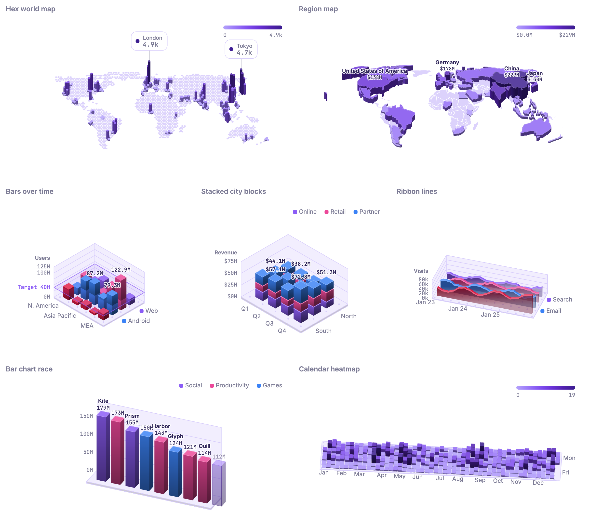

# plottwist.js

Isometric, animated, interactive charts for the web. Zero runtime dependencies, Canvas 2D.



```js
import { IsoBarChart, IsoHexMap } from 'plottwist';

const bars = new IsoBarChart('#chart', {
  frames: [{ label: 2024, data: [...] }, { label: 2025, data: [...] }],
  x: 'region',
  y: 'platform',
  value: 'users',
});
bars.play();

const map = new IsoHexMap('#map', {
  data: [{ lon: 2.35, lat: 48.86, value: 120 }, ...],
  rounding: 0.45, // 0 = sharp hexes, 1 = nearly round
  columns: 110,   // hexes across the map
  callouts: 5,
});
map.project(-74, 40.7); // screen position of a coordinate
map.hexAt(-74, 40.7);   // the hex containing it
```

## Install

```sh
npm install plottwist
```

Or without a build step:

```html
<script src="https://cdn.jsdelivr.net/npm/plottwist/dist/plottwist.iife.min.js"></script>
<script>
  new plottwist.IsoBarChart('#chart', { data });
</script>
```

TypeScript types are included; charts are generic over your record type, so accessors like
`x: 'region'` are checked against your data.

## Charts

- `IsoBarChart`: grouped or stacked (`stack`) 3D bars on a categorical grid
- `IsoHeatmap`: extruded tiles on a sequential scale, e.g. a contribution calendar
- `IsoRibbonChart`: one extruded ribbon per series, x along the floor
- `IsoHexMap`: rounded hexagons over the world (or `bounds`), data binned by exact coordinates; arcs and callouts
- `IsoRegionMap`: regions at any level (countries, states, provinces, counties, districts, territories)
  extruded by value, a 3D choropleth. See below.

Grid charts get a value axis on back walls that follow the camera (`axis: false` to hide), a dashed
level line from the hovered mark to the axis, value labels (`labels: true | N`) and a reference
plane (`reference: { value, label }`) that bars rise through.

All charts support `frames` + `play()/pause()/seek()`, view presets (`setView('iso' | 'top' | 'front')`),
orbit/zoom, hover tooltips and `on('hover' | 'click' | 'frame')`.

## Region maps at any level

`IsoRegionMap` draws whatever regions you give it, as GeoJSON or TopoJSON:

```js
import { IsoRegionMap } from 'plottwist';
import { worldCountries } from 'plottwist/geo/countries'; // or 'plottwist/geo/countries-50m' (crisper)

// Countries, joined on ISO codes or names ('DE', 'DEU', '276' and 'Germany' all match).
const map = new IsoRegionMap(el, { regions: worldCountries(), data, key: 'country', value: 'gdp' });

// Your own boundaries: provinces, counties, districts, sales territories...
new IsoRegionMap(el, {
  regions: usAtlas,              // TopoJSON works directly
  object: 'counties',            // which layer
  filter: (f) => f.id.startsWith('06'),
  regionName: (f) => f.properties.NAME_2,
  lon: 'lng', lat: 'lat',        // no region key? records land in the region containing them
  data: stores,
});

// Drill between levels; drillUp() goes back.
map.on('click', (region) => map.drill(statesOf(region), { key: 'state', data: stateData }));
```

`bounds` crops (and clips) to a box, `detail` trades shape detail for speed, and `borderWidth`,
`borderColor`, `edgeWidth` and `edgeColor` style the strokes. `topojsonFeatures(topology, object)`
converts TopoJSON for other uses.

## Theming

Canvases are transparent: the page owns the background. Presets are `midnight` (default) and `dark`.

```js
registerTheme('brand', { extends: 'midnight', series: ['#7c5cff', '#ff4f9a'], glow: 0.6, gridStyle: 'dots' });
new IsoBarChart(el, { data, theme: 'brand', grid: 'none', colors: { Online: '#7c5cff' } });
```

## Development

```sh
npm run dev   # http://localhost:5173/examples/ with live reload
npm test                     # unit tests
npm run test:types           # type definitions against example usage
npm run test:visual          # pixel comparison with test/visual/baseline (-- --update to accept)
npm run build                # dist/ bundles
npm run showcase             # re-render the README image (docs/showcase.png)
node scripts/build-land.js   # regenerate src/geo/land.js from Natural Earth
node scripts/build-countries.js  # regenerate src/geo/countries-data.js
```

Land data: [Natural Earth](https://www.naturalearthdata.com/) (public domain) via
[world-atlas](https://github.com/topojson/world-atlas) (ISC).
